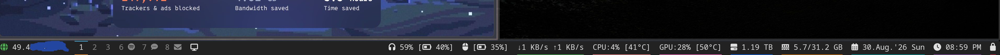
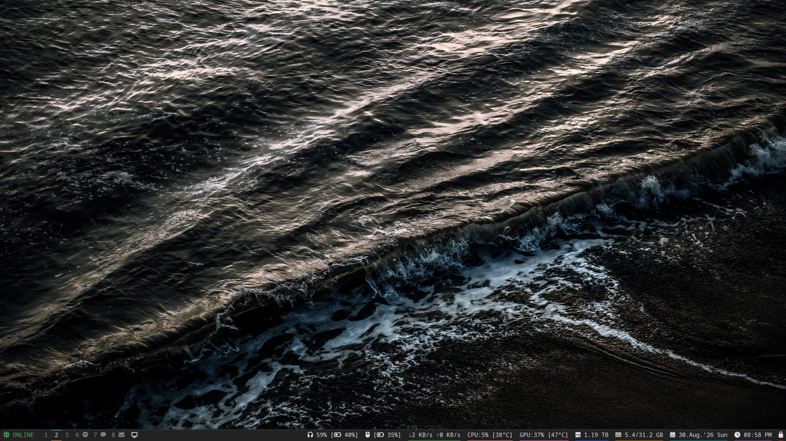
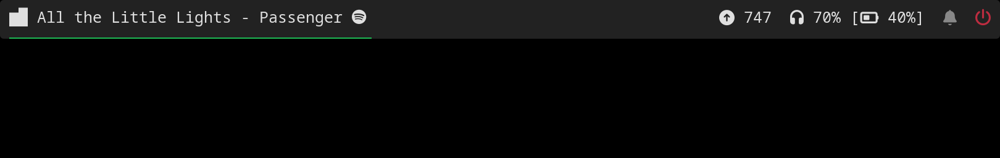
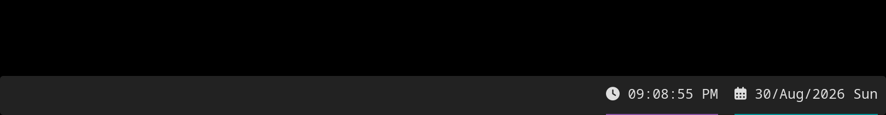
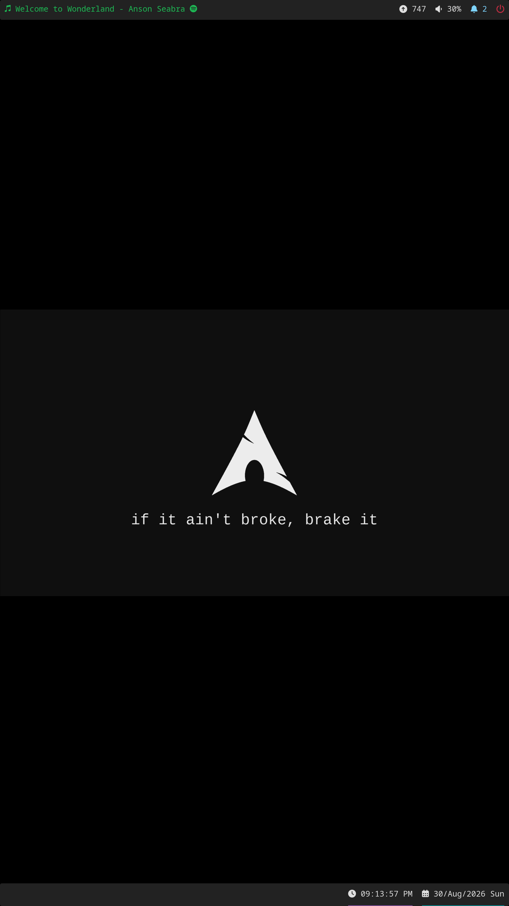

# dotfiles

This repo contains all my dotfiles except [my neovim configs](https://github.com/codetit4n/nvim-config) for `Arch Linux`

### Install

```bash
sh install.sh
```

### Sync - Put system files in the repo

```bash
sh sync.sh
```

### Tools I use

- [fish](https://fishshell.com)
- [tmux](https://github.com/tmux/tmux)
- [alacritty](https://github.com/alacritty/alacritty)
- [starship](https://github.com/starship/starship)
- [neovim](https://github.com/neovim/neovim)
- [i3](https://i3wm.org/)
- [polybar](https://github.com/polybar/polybar)

### Screenshots

I run a two monitor setup. Here are some screenshots:

#### Main Monitor (Horizontal) - `3840x2160`

- Polybar Zoomed:
  
- Full Monitor:
  

#### Secondary Monitor (Vertical) - `1920x1080`

- Top Polybar Zoomed:
  
- Bottom Polybar Zoomed:
  
- Full Monitor:
  

You can find the wallpapers I use [here](./wallpapers).
